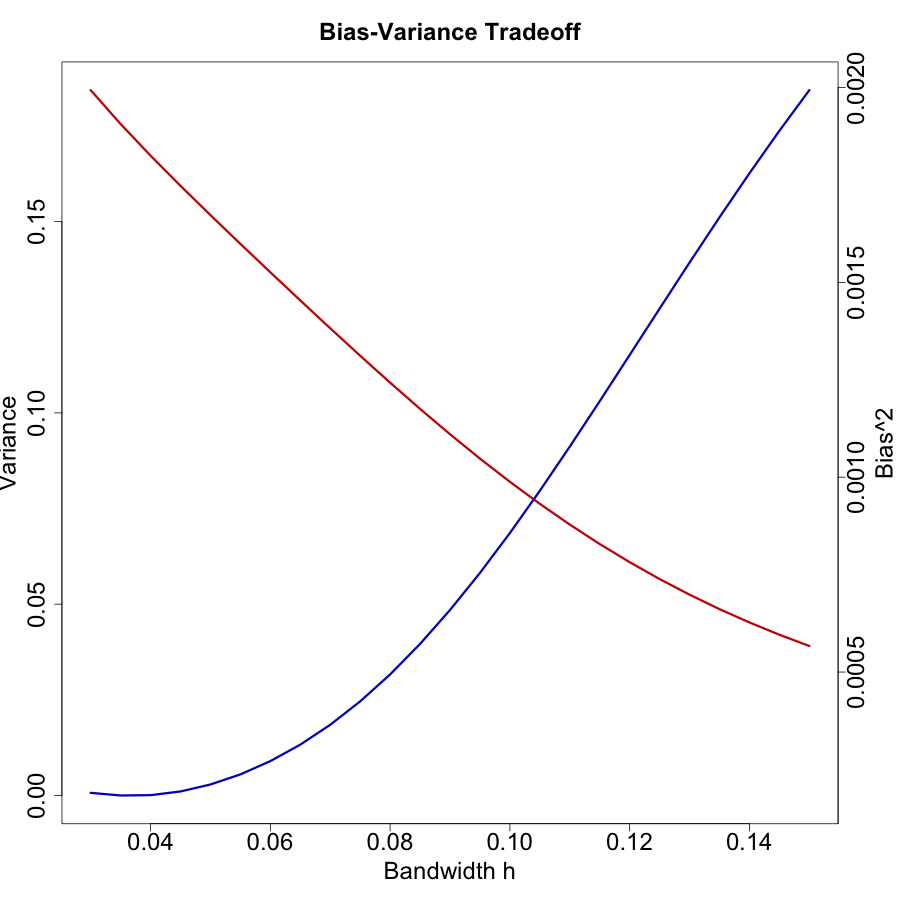
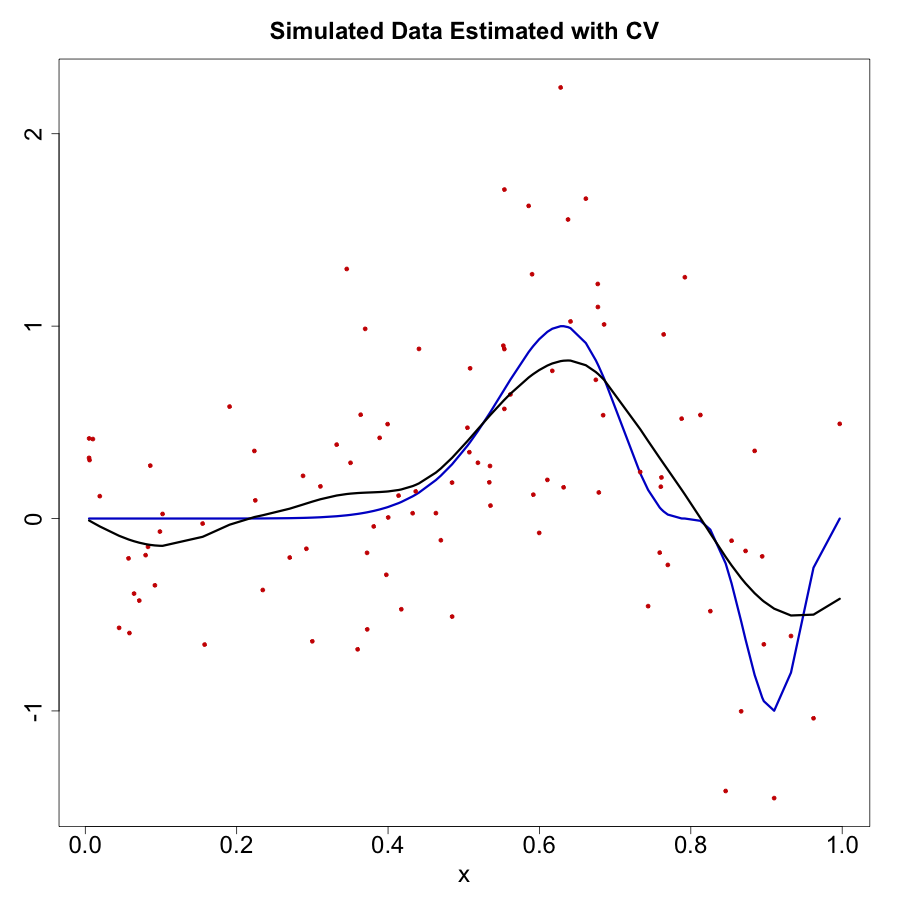
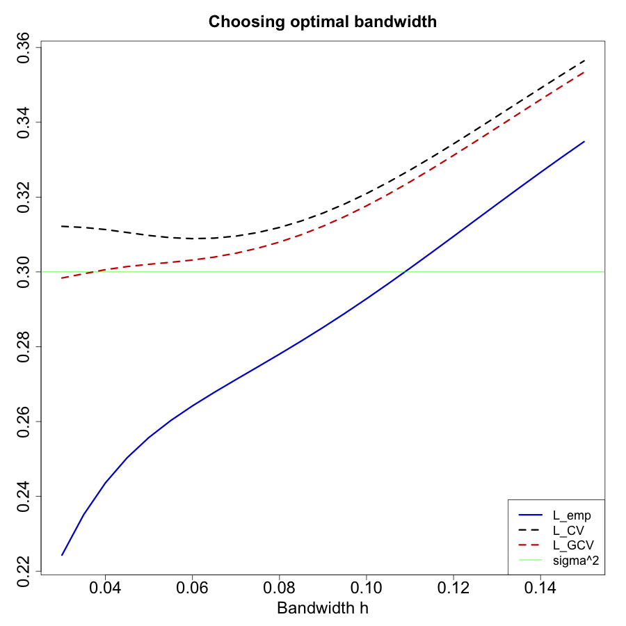
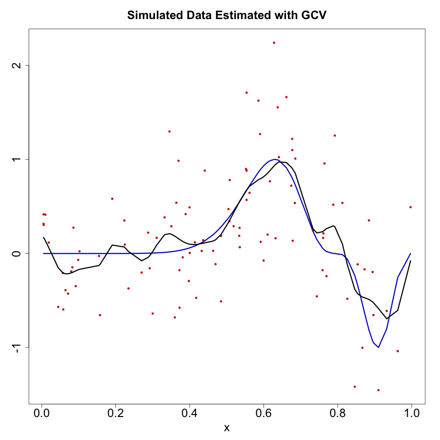

[](http://quantlet.de/)

## [](http://quantlet.de/) **PAC_CV_GCV** [](http://quantlet.de/)

```yaml


Name of Quantlet: PAC_CV_GCV

Published in: Metis

Description: 'Fitting the bandwidth of Nadaraya-Watson estimator to simulated data on an interval using cross-validation and generalised cross-validation in R and Python'

Keywords: smoothing, Nadaraya-Watson, cross-validation, generalised cross-validation, empirical error

Author: Anna Shchekina, Lili Matic, Wolfgang Karl Härdle

See also: QID-2142-SPMsimulmase

Submitted: 2021-05-17

```









### R Code
```r

# clear variables
rm(list = ls(all = TRUE))

# install and load packages
libraries = c("locpol", "dplyr")
lapply(libraries, function(x) if (!(x %in% installed.packages())) {
  install.packages(x) })
lapply(libraries, library, quietly = TRUE, character.only = TRUE)


# specify the model
set.seed(201053)
n = 100  # number of observations
n_MC = 10 # number of Monte-Carlo iterations
sigma2 = 0.3
sigma = sqrt(sigma2) 
x = runif(n) %>% sort() # uniform sample
f = (sin(2*pi*(x^3)))^3 %>% unname() # true line

y_sim <- function() {
  eps = rnorm(n) * sigma  # error
  y = f + eps
  return(y)
}  

# bandwidth grid
n_h = 25
h = seq(0.03, by = (0.15-0.03)/(n_h-1), length = n_h)

# Nadaraya-Watson estimator
fNW <- function(x, X, Y, h, K = dnorm) {
  Kx <- sapply(X, function(Xi) K((x - Xi) / h) / h)
  if (is.vector(Kx)) Kx = matrix(Kx, nrow = 1)
  W <- Kx / rowSums(Kx) 
  drop(W %*% Y)
}  
  
# compute empirical, LOO CV and GCV errors, variance and bias^2 
# for given data sample and a range of bandwidths
L_CV = matrix(0, n_h, 1)
L_GCV = L_CV
L_emp = L_CV
bias_MC = L_CV
m1_MC = L_CV
m2_MC = L_CV

y = y_sim()

for (k in 1:n_h) {
  # Nadaraya–Watson with Gaussian kernel 
  fh = fNW(x = x, X = x, Y = y, h = h[k])
  # empirical error
  L_emp[k] = mean((y - fh)^2) 
  # LOO CV
  fh_cv = sapply(1:n, function(i) 
    fNW(x = x[i], X = x[-i], Y = y[-i], h = h[k]))
  L_CV[k] = mean((y - fh_cv)^2)
  # GCV
  tr_est = dnorm(0)/h[k]
  L_GCV[k] = 1/(1 - tr_est/n)^2 * L_emp[k]
}

# Monte-Carlo estimates of true bias and variance
for (j in 1:n_MC) {
  y_MC = y_sim()
  for (k in 1:n_h) {
    fh_MC = fNW(x = x, X = x, Y = y_MC, h = h[k])
    bias_MC[k] = bias_MC[k] + mean(fh_MC - f)
    m1_MC[k] = m1_MC[k] + mean(fh_MC)
    m2_MC[k] = m2_MC[k] + mean(fh_MC^2)
  }
}
bias_MC = bias_MC/n_MC
var_MC = m2_MC/n_MC - (m1_MC/n_MC)^2


# plot
png("errors.png", width = 900, height = 900, bg = "transparent")
plot(h, L_CV, type = "l", lwd = 3, lty = 2, col = "black", xlab = "Bandwidth h", 
     ylab = "", cex.lab = 2, cex.axis = 2, ylim = c(min(L_emp), max(L_CV)))
title("Choosing optimal bandwidth", cex.main = 2)
lines(h, L_emp, lwd = 3, lty = 1, col = "blue3")
abline(h = sigma2, col = "green", lwd = 1, lty = 1)
lines(h, L_GCV, lwd = 3, lty = 2, col = "red3")
legend("bottomright", c("L_emp", "L_CV", "L_GCV", "sigma^2"), lty = c(1, 2, 2, 1), 
       lwd = c(3, 3, 3, 1), col = c("blue3", "black", "red3", "green"), cex = 1.5)
dev.off()

png("bv.png", width = 900, height = 900, bg = "transparent")
par(mar = c(5, 4, 4, 4) + 0.3)
plot(h, var_MC, type = "l", lwd = 3, col = "red3", xlab = "Bandwidth h", ylab = "Variance", 
     cex.lab = 2, cex.axis = 2, ylim = c(0, max(var_MC)))
par(new = TRUE)
plot(h, bias_MC^2, type = "l", lwd = 3, axes = FALSE, col = "blue3", ylab = "", xlab = "")
axis(side = 4, at = pretty(range(bias_MC^2)), cex.axis = 2)
mtext("Bias^2", side = 4, line = 3, cex = 2)
title("Bias-Variance Tradeoff", cex.main = 2)
dev.off()

# choose optimal h acc CV
h_cv = h[which(L_CV == min(L_CV))]
f_cv = fNW(x = x, X = x, Y = y, h = h_cv)

png("cv.png", width = 900, height = 900, bg = "transparent")
plot(x, f, type = "l",col = "blue3", lwd = 3, ylab = "", 
     xlab = "x", cex.lab = 2, cex.axis = 2, ylim = range(y))
title("Simulated Data Estimated with CV", cex.main = 2)
points(x, y, pch = 19, col = "red3", cex = 0.7)
lines(x, f_cv, lwd = 3)
dev.off()

# choose optimal h acc GCV
h_gcv = h[which(L_GCV == min(L_GCV))]
f_gcv = fNW(x = x, X = x, Y = y, h = h_gcv)

png("gcv.png", width = 900, height = 900, bg = "transparent")
plot(x, f, type = "l", col = "blue3", lwd = 3, ylab = "", 
     xlab = "x", cex.lab = 2, cex.axis = 2, ylim = range(y))
title("Simulated Data Estimated with GCV", cex.main = 2)
points(x, y, pch = 19, col = "red3", cex = 0.7)
lines(x, f_gcv, lwd = 3)
dev.off()

```

### Python Code
```python

import numpy as np
import scipy as sp
import random as r
from scipy.stats import norm
import matplotlib.pyplot as plt

# Data generation process

# Fix some general setup variables

r.seed(201053)

# sample size n 

n = 100

# Monte Carlo iterations J

J = 10

# number  of repetitions for the CV exercise J_cv 

J_cv = 1      

# noise variance

sig2 = 0.3

# Define colors

col_pink = 'hotpink'
col_blue = 'b'
col_red  = 'indianred'
col_navy = 'navy'

## 1. Generate  X$\sim U [0,1]$

x = sp.random.uniform(0,1,n)
x.sort()

## 2. Generate $y_i = \sin^3(2\pi x_i^3) + \varepsilon_i,  i\in [1,n]$, where $\varepsilon_i \sim N(0,\sigma_\varepsilon^2)$ and $\sigma^2_\varepsilon = 0.3$

# 2a) Generate $\varepsilon_i \sim N(0,\sigma_\varepsilon^2)$ with $\sigma^2_\varepsilon $ to be determined

# Only for illustration - regenerated in next block!

sigma = np.sqrt(sig2)
eps = np.random.normal(0, sigma,  n)

# 2b) Generate $y_i = \sin^3(2\pi x_i^3) + \varepsilon_i$ for $i\in 1:n$

def f(x):
    return (np.sin(2*np.pi*(x**3)))**3

def gendata(f, sigma, n):
    return ( f + np.random.normal(0, sigma, n) ) 
            
f_x = f(x)
y = gendata(f_x, sigma, n)

## Data plot

fig, ax = plt.subplots(1, 1)
ax.plot(x, y, 'o', color=col_red)
ax.plot(x,f_x,'-g',color=col_blue, lw=3)

# Kernel regression smoothing with NW kernel estimator

## Smoothing with Gaussian Kernel

# Naradaya-Watson at points t, a mesh of grid points
def nw_inner(t, x, y, h):
    K_h = norm.pdf( (t-x)/h )/h
    den = sum(K_h)
    w   = K_h/den
    nw  = np.dot(w, y) 
    return nw

# f_h estimation 
def fh(ts, x, y, h):
    return [nw_inner(t, x ,y ,h) for t in ts]

# trial bandwidth for Gaussian kernel, note that in terms of Uni (box car) kernel 
# this has to be multiplied with 1.35/0.77, i.e. we for h=0.01 are averaging over the window (t - 0.0175, t + 0.0175)
# LM change the NW smoother !!!! 

h = 0.02

# NW estimation

f_h = fh(x, x, y, h) 

fig, ax = plt.subplots(1, 1)
ax.plot(x, y, 'o', color= col_red)
ax.plot(x,f_h,'-g',color= col_blue, lw=3)

# Bias-variance decomposition

# Estimation for some bandwidths e.g. $h \in [0.01, 0.02, \dots, 0.1]$

h = list( np.linspace(0.01, 0.3, 25) )

# Repeat data generation J times

f_h = np.zeros( (n, len(h)) )
E_fh =  np.zeros( (n, len(h)) )
bias = np.zeros( (n, len(h)) )
variance = np.zeros( (n, len(h)) )
CV = np.zeros( len(h) )
CV_all = np.zeros( (J_cv, len(h)) )   # collects the CVs over simulations
L_emp = np.zeros( (J_cv, len(h)) )    # collects the emp error over simulations

#  Computation of bias

r.seed(201053)      # fix seed to have bias and variance calculated on the same random set

for j in range(1, J):
    y = gendata(f_x, sigma, n)
    for i in range(len(h)):
        f_h[:,i] = fh(x, x, y, h[i])
        E_fh[:,i] = E_fh[:,i] + f_h[:,i] 
    # end h loop
        
# end J loop

E_fh = E_fh/J

# now calc bias
for i in range(len(h)):
    bias[:,i] = E_fh[:,i] - f_x
    # end h loop

bias2 = bias**2
Int_bias_h = np.sum(bias2, axis = 0)/n

plt.plot(h, Int_bias_h, color=col_blue, lw = 3)

r.seed(201053)
for j in range(1,J):
    y = gendata(f_x, sigma, n)
    for i in range(len(h)):
        f_h[:,i] = fh(x, x, y, h[i])
        variance[:,i] = variance[:,i] +  (f_h[:,i]  - E_fh[:,i])**2
    # end h loop
        
# end J loop  

variance = variance/J

Int_var_h = np.sum(variance, axis = 0)/n 

plt.plot(h, Int_var_h, color=col_red, lw = 3)

# Plot bias-variance-tradeoff

fig, ax1 = plt.subplots()
ax1.set_xlabel('bandwidth h')
ax1.set_ylabel('squared bias', color=col_blue)
ax1.plot(h, Int_bias_h, color=col_blue, lw = 3)
ax1.tick_params(axis='y', labelcolor=col_blue)

ax2 = ax1.twinx()  

col_red = 'tab:red'
ax2.set_ylabel('variance', color=col_red)  
ax2.plot(h, Int_var_h, color=col_red, lw = 3)
ax2.tick_params(axis='y', labelcolor=col_red)

fig.tight_layout()  
plt.show()

plt.plot(h, Int_bias_h + Int_var_h, color = col_navy, lw=3)

## Cross-validation

r.seed(201053)      # fix seed to have bias and variance calculated on the same random set

for j in range(J_cv):
    y = gendata(f_x, sigma, n)
    for i in range( len(h) ):
        f_l = 0
        for l in range( len(x) ):
            x_l = np.delete(x, l,  axis = 0)
            y_l = np.delete(y, l,  axis = 0)
            u = fh([x[l]], x_l, y_l, h[i]) 
            f_l = f_l + (y[l] - u)**2 
          
            # end l loop over obs
        CV[i] = f_l
        
    # end h loop
    
        CV_all[j, i] = CV[i]/n
# end J loop
CV_mean = np.mean( CV_all, axis = 0 )

plt.plot(h, CV_mean, lw = 3,  color = col_pink)

r.seed(201053)

for j in range(J_cv):
    y = gendata(f_x, sigma, n)
    for i in range(  len(h) ):
        f_h[:,i] = fh(x, x, y, h[i])
        L_emp[j,i] = np.mean( (y - f_h[:,i])**2 , axis = 0)
    # end h loop

# end J loop  

L_emp = L_emp/J_cv
L_emp_mean = np.mean( L_emp, axis = 0 )

## Generalized Cross-validation

inner_t = (norm.pdf(0)/h)/n      # tr( S(h)/n )

L_GCV = L_emp/( (1-inner_t)**2 )

L_GCV_mean = np.mean( L_GCV, axis = 0 )

plt.plot(h, sig2 + np.zeros( len(h) ), color=col_pink, lw=3)
plt.plot(h, CV_mean,linestyle='dashdot', color=col_blue, lw=3)
plt.plot(h, L_emp_mean, color= col_red, lw=3)
plt.plot(h, L_GCV_mean, linestyle='dotted', color = 'green', lw=3)

```
